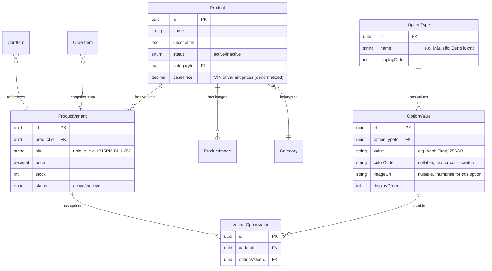
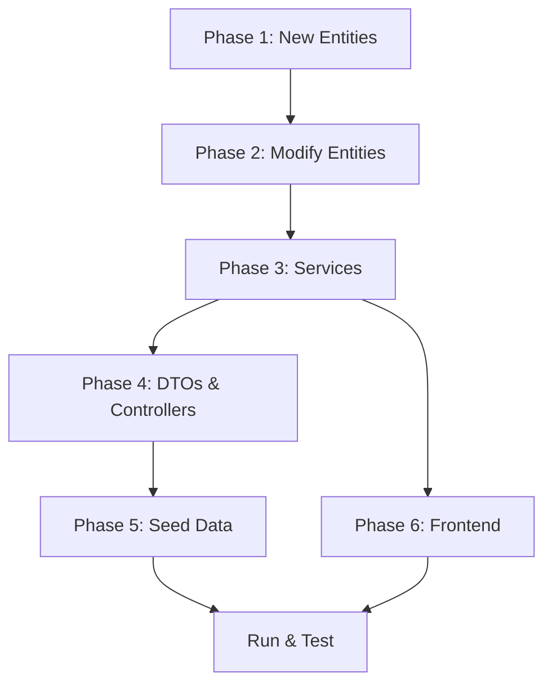

# 🏗️ Implementation Plan: Product Variants (SKU System)

> **Decisions Locked:** Dynamic EAV, variant-level pricing/stock, SKU codes, Shopee-style UI, images on OptionValue, all products have ≥1 variant, reset seed, matrix generation, stock at variant only.

---

## Database Schema (New & Modified Entities)



> [!IMPORTANT]
> **Key change:** `price` and `stock` move FROM `Product` TO `ProductVariant`. Product keeps a denormalized `basePrice` (min variant price) for listing pages.

---

## 6 Phases Overview

| Phase | What | Files Changed | Est. |
|-------|------|---------------|------|
| **1** | New backend entities | 4 new entity files | 1h |
| **2** | Modify existing entities | product, cart-item, order-item entities | 1h |
| **3** | New Options module + Update services | New module + rewrite products/cart/orders services | 4h |
| **4** | DTOs & Controllers | New/modified DTOs, controller endpoints | 2h |
| **5** | Seed data with variants | Rewrite seed.service.ts | 1.5h |
| **6** | Frontend (types, API, UI) | types.ts, services.ts, product detail page, cart, admin | 4h |

**Total estimated: ~13.5 hours**

---

## Phase 1: New Backend Entities

### 1.1 `src/products/entities/option-type.entity.ts` (NEW)
```typescript
@Entity('option_types')
export class OptionType extends BaseEntity {
  @Column() name: string;                    // "Màu sắc", "Dung lượng"
  @Column({ default: 0 }) displayOrder: number;
  @OneToMany(() => OptionValue, v => v.optionType, { cascade: true })
  values: OptionValue[];
}
```

### 1.2 `src/products/entities/option-value.entity.ts` (NEW)
```typescript
@Entity('option_values')
export class OptionValue extends BaseEntity {
  @Column() value: string;                   // "Xanh Titan", "256GB"
  @Column({ nullable: true }) colorCode: string;  // "#4B6CB7" for color swatches
  @Column({ nullable: true }) imageUrl: string;    // thumbnail for this option
  @Column({ default: 0 }) displayOrder: number;
  @ManyToOne(() => OptionType, t => t.values, { onDelete: 'CASCADE' })
  optionType: OptionType;
}
```

### 1.3 `src/products/entities/product-variant.entity.ts` (NEW)
```typescript
@Entity('product_variants')
@Index(['sku'], { unique: true })
export class ProductVariant extends BaseEntity {
  @Column({ unique: true }) sku: string;
  @Column('decimal', { precision: 10, scale: 2 }) price: number;
  @Column({ default: 0 }) stock: number;
  @Column({ type: 'enum', enum: ['active','inactive'], default: 'active' }) status: string;
  @ManyToOne(() => Product, p => p.variants, { onDelete: 'CASCADE' })
  product: Product;
  @OneToMany(() => VariantOptionValue, v => v.variant, { cascade: true })
  optionValues: VariantOptionValue[];
}
```

### 1.4 `src/products/entities/variant-option-value.entity.ts` (NEW)
```typescript
@Entity('variant_option_values')
export class VariantOptionValue extends BaseEntity {
  @ManyToOne(() => ProductVariant, v => v.optionValues, { onDelete: 'CASCADE' })
  variant: ProductVariant;
  @ManyToOne(() => OptionValue, { eager: true })
  optionValue: OptionValue;
}
```

---

## Phase 2: Modify Existing Entities

### 2.1 `product.entity.ts` — MODIFY
```diff
 export class Product extends BaseEntity {
   @Column() name: string;
   @Column('text') description: string;
-  @Column('decimal', { precision: 10, scale: 2 }) price: number;
-  @Column({ default: 0 }) stock: number;
+  @Column('decimal', { precision: 10, scale: 2, default: 0 }) basePrice: number;
   @Column({ type: 'enum', enum: ['active','inactive'], default: 'active' }) status: string;
   @ManyToOne(() => Category, c => c.products) category: Category;
   @OneToMany(() => ProductImage, i => i.product, { cascade: true }) images: ProductImage[];
+  @OneToMany(() => ProductVariant, v => v.product, { cascade: true }) variants: ProductVariant[];
 }
```

### 2.2 `cart-item.entity.ts` — MODIFY
```diff
 export class CartItem extends BaseEntity {
   @ManyToOne('Cart', 'items', { onDelete: 'CASCADE' }) cart: Cart;
-  @ManyToOne(() => Product) product: Product;
+  @ManyToOne(() => ProductVariant) variant: ProductVariant;
   @Column() quantity: number;
 }
```

### 2.3 `order-item.entity.ts` — MODIFY
```diff
 export class OrderItem extends BaseEntity {
   @ManyToOne(() => Order, o => o.items, { onDelete: 'CASCADE' }) order: Order;
-  @ManyToOne(() => Product) product: Product;
+  @ManyToOne(() => ProductVariant, { nullable: true }) variant: ProductVariant;
   @Column() productNameSnapshot: string;
   @Column('decimal', { precision: 10, scale: 2 }) unitPriceSnapshot: number;
   @Column() quantity: number;
   @Column('decimal', { precision: 10, scale: 2 }) subtotal: number;
+  @Column({ nullable: true }) skuSnapshot: string;
+  @Column('json', { nullable: true }) variantSnapshot: object;
   // variantSnapshot = { "Màu sắc": "Xanh Titan", "Dung lượng": "256GB" }
 }
```

---

## Phase 3: Services Rewrite

### 3.1 New `OptionsModule` (NEW)
- **Files:** `src/options/options.module.ts`, `options.service.ts`, `options.controller.ts`, DTOs
- **Endpoints:**
  - `GET /admin/options` — list all option types with values
  - `POST /admin/options` — create option type (e.g. "Màu sắc")
  - `POST /admin/options/:id/values` — add value (e.g. "Xanh Titan")
  - `PUT/DELETE` for option types and values

### 3.2 `products.service.ts` — Major Rewrite

**Key changes:**
| Method | Change |
|--------|--------|
| `findAll()` | Join variants to get `basePrice`, show price range "Từ X đ" |
| `findOne()` | Return `variants[]` with their `optionValues[]`, grouped by optionType |
| `createProduct()` | No longer requires `price`/`stock`. Creates product shell. |
| `updateProduct()` | Remove price/stock updates |
| NEW `generateVariants()` | Input: `{ options: [{typeId, valueIds}] }` → Cartesian product → bulk create variants |
| NEW `updateVariant()` | Update individual variant's price/stock/sku |
| NEW `deleteVariant()` | Remove a variant |
| `updateBasePrice()` | Helper: recalculate `product.basePrice = MIN(variant.price)` |

**`findOne()` response format (new):**
```typescript
{
  id, name, description, status, basePrice,
  category: { id, name },
  images: [...],
  options: [
    {
      id: "opt-type-id", name: "Màu sắc", displayOrder: 0,
      values: [
        { id: "val-id", value: "Xanh Titan", colorCode: "#4B6CB7", imageUrl: "..." },
        { id: "val-id", value: "Đen Titan", colorCode: "#1D1D1F", imageUrl: "..." }
      ]
    },
    {
      id: "opt-type-id", name: "Dung lượng", displayOrder: 1,
      values: [
        { id: "val-id", value: "256GB" },
        { id: "val-id", value: "512GB" }
      ]
    }
  ],
  variants: [
    { id, sku: "IP15PM-BLU-256", price: 29990000, stock: 12, status: "active",
      optionValues: [
        { optionType: "Màu sắc", value: "Xanh Titan" },
        { optionType: "Dung lượng", value: "256GB" }
      ]
    },
    // ... 19 more variants
  ]
}
```

### 3.3 `cart.service.ts` — Rewrite

**Key changes:**
- `AddToCartDto`: `productId` → `variantId`
- `addToCart()`: check `variant.stock` instead of `product.stock`, lock variant row
- `formatCartResponse()`: include variant info (sku, optionValues) in response
- Cart item uniqueness: keyed by `variantId` (not productId)

### 3.4 `orders.service.ts` — Rewrite

**Key changes:**
- Stock check: `variant.stock` with pessimistic lock on `ProductVariant`
- Snapshot: save `skuSnapshot` + `variantSnapshot` (JSON of option values)
- Stock deduction: `UPDATE product_variants SET stock = stock - X WHERE id = ?`
- Cancel restore: restore to variant stock

---

## Phase 4: DTOs & Controllers

### New/Modified DTOs

| DTO | Type | Fields |
|-----|------|--------|
| `CreateOptionTypeDto` | NEW | `name`, `displayOrder?` |
| `CreateOptionValueDto` | NEW | `value`, `colorCode?`, `imageUrl?`, `displayOrder?` |
| `GenerateVariantsDto` | NEW | `options: [{optionTypeId, optionValueIds}]` |
| `UpdateVariantDto` | NEW | `sku?`, `price?`, `stock?`, `status?` |
| `CreateProductDto` | MODIFY | Remove `price`, `stock` |
| `AddToCartDto` | MODIFY | `productId` → `variantId` |

### New Admin Endpoints

| Method | Path | Purpose |
|--------|------|---------|
| `GET` | `/admin/options` | List all option types |
| `POST` | `/admin/options` | Create option type |
| `PUT` | `/admin/options/:id` | Update option type |
| `DELETE` | `/admin/options/:id` | Delete option type |
| `POST` | `/admin/options/:id/values` | Add option value |
| `PUT` | `/admin/options/:typeId/values/:valueId` | Update value |
| `DELETE` | `/admin/options/:typeId/values/:valueId` | Delete value |
| `POST` | `/admin/products/:id/variants/generate` | Generate variant matrix |
| `PUT` | `/admin/products/:id/variants/:variantId` | Update single variant |
| `DELETE` | `/admin/products/:id/variants/:variantId` | Delete variant |

---

## Phase 5: Seed Data

Rewrite `seed.service.ts` to:
1. Clear new tables: `variant_option_values`, `product_variants`, `option_values`, `option_types`
2. Seed OptionTypes: Màu sắc, Dung lượng, RAM, Size Màn hình
3. Seed OptionValues with colorCodes and imageUrls
4. Seed products WITHOUT price/stock
5. Generate variants with real SKUs, prices, stock per variant

**Example seed for iPhone 15 Pro Max:**
```
OptionType "Màu sắc" → [Titan Xanh, Titan Tự Nhiên, Titan Trắng, Titan Đen]
OptionType "Dung lượng" → [256GB, 512GB, 1TB]

Product: "iPhone 15 Pro Max"
Variants generated (4×3 = 12):
  IP15PM-BLU-256 → 29,990,000₫ → stock: 12
  IP15PM-BLU-512 → 34,990,000₫ → stock: 8
  IP15PM-BLU-1TB → 39,990,000₫ → stock: 5
  IP15PM-NAT-256 → 29,990,000₫ → stock: 15
  ... (8 more)

basePrice auto-set to: 29,990,000₫ (MIN)
```

For simple products (Sạc MagSafe): 1 variant, 0 option values.

---

## Phase 6: Frontend Changes

### 6.1 `lib/api/types.ts` — Add new types
```typescript
interface OptionType { id: string; name: string; displayOrder: number; }
interface OptionValueItem {
  id: string; value: string;
  colorCode?: string; imageUrl?: string;
}
interface ProductVariantItem {
  id: string; sku: string; price: number; stock: number; status: string;
  optionValues: { optionType: string; value: string; }[];
}
// Update ProductDetail to include options[] and variants[]
// Update CartItem.product → CartItem.variant
// Update AddToCartRequest: productId → variantId
```

### 6.2 `lib/api/services.ts` — Add variant endpoints
- `adminApi.generateVariants(token, productId, body)`
- `adminApi.updateVariant(token, productId, variantId, body)`
- `cartApi.addItem`: body changes to `{ variantId, quantity }`

### 6.3 Product Detail Page — Shopee-style Selector

**UI Flow:**
1. Display option type groups as button rows (Color buttons with swatches, Storage buttons)
2. When user selects options → find matching variant → show its price & stock
3. Disable buttons for combos that are out of stock
4. "Add to Cart" sends `variantId` instead of `productId`

### 6.4 Cart Page — Variant Sub-text
```
iPhone 15 Pro Max
  Xanh Titan | 256GB            ×2    59,980,000₫
```

### 6.5 Admin Product Form — Matrix Generator
1. Step 1: Basic info (name, desc, category)
2. Step 2: Select option types → select values per type
3. Step 3: Click "Generate" → matrix table appears
4. Step 4: Fill price/stock/SKU per row (bulk edit support)

---

## Execution Order & Dependencies



> [!WARNING]
> After Phase 2, the app will NOT compile until Phase 3 is complete (services reference old fields). Plan to do Phases 1-4 in one session.

---

## Files Summary (Complete Change List)

**NEW files (10):**
| File | Purpose |
|------|---------|
| `src/products/entities/option-type.entity.ts` | OptionType entity |
| `src/products/entities/option-value.entity.ts` | OptionValue entity |
| `src/products/entities/product-variant.entity.ts` | ProductVariant entity |
| `src/products/entities/variant-option-value.entity.ts` | Junction entity |
| `src/options/options.module.ts` | Options NestJS module |
| `src/options/options.service.ts` | CRUD for option types/values |
| `src/options/options.controller.ts` | Admin endpoints for options |
| `src/options/dto/create-option-type.dto.ts` | DTO |
| `src/options/dto/create-option-value.dto.ts` | DTO |
| `src/products/dto/generate-variants.dto.ts` | DTO for matrix generation |

**MODIFIED files (18):**
| File | Change Level |
|------|-------------|
| `src/products/entities/product.entity.ts` | 🔴 Major |
| `src/cart/entities/cart-item.entity.ts` | 🔴 Major |
| `src/orders/entities/order-item.entity.ts` | 🔴 Major |
| `src/products/products.service.ts` | 🔴 Major rewrite |
| `src/cart/cart.service.ts` | 🔴 Major rewrite |
| `src/orders/orders.service.ts` | 🔴 Major rewrite |
| `src/products/products.module.ts` | 🟡 Add new entities |
| `src/cart/cart.module.ts` | 🟡 ProductVariant import |
| `src/orders/orders.module.ts` | 🟡 ProductVariant import |
| `src/app.module.ts` | 🟡 Add OptionsModule |
| `src/products/dto/create-product.dto.ts` | 🟡 Remove price/stock |
| `src/products/dto/update-product.dto.ts` | 🟡 Remove price/stock |
| `src/products/admin-products.controller.ts` | 🟡 Add variant endpoints |
| `src/cart/dto/add-to-cart.dto.ts` | 🟡 variantId |
| `src/database/seeds/seed.service.ts` | 🔴 Full rewrite |
| `src/database/seeds/seed.module.ts` | 🟡 Add new entities |
| `frontend/lib/api/types.ts` | 🔴 Major additions |
| `frontend/lib/api/services.ts` | 🟡 New endpoints |
| `frontend/app/products/[id]/page.tsx` | 🔴 Variant selector UI |
| `frontend/app/admin/products/page.tsx` | 🔴 Matrix generator UI |
